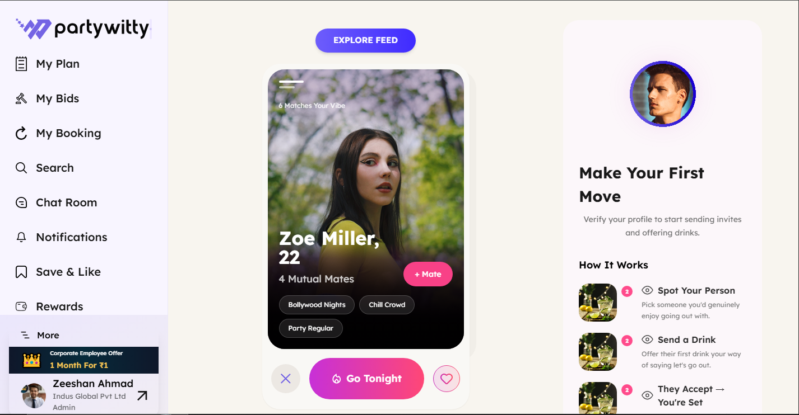
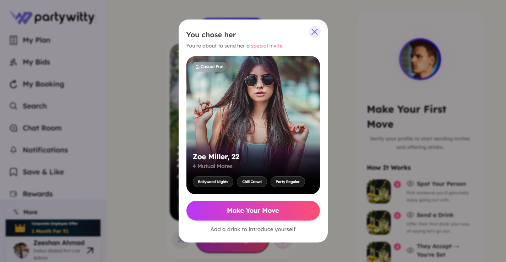
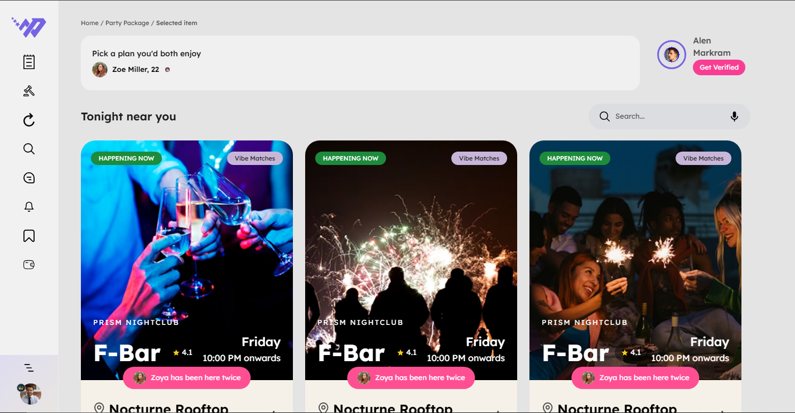
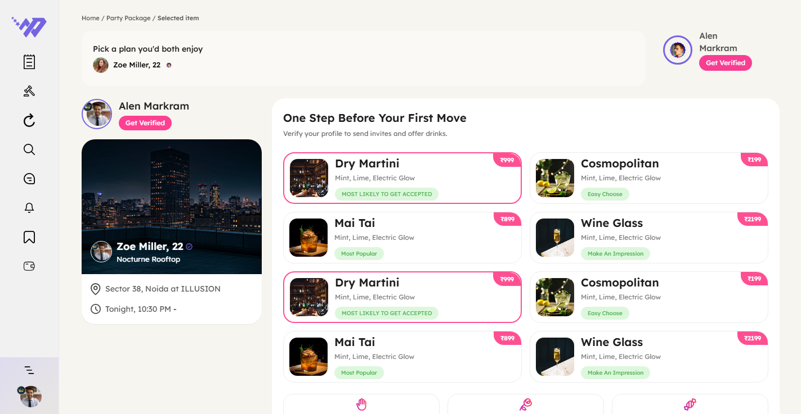
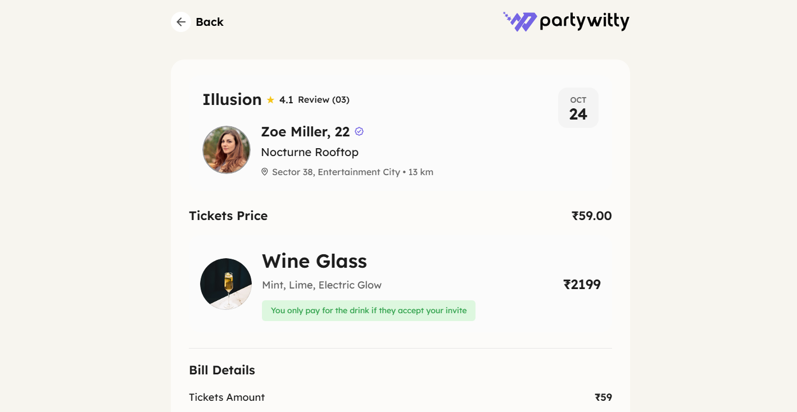
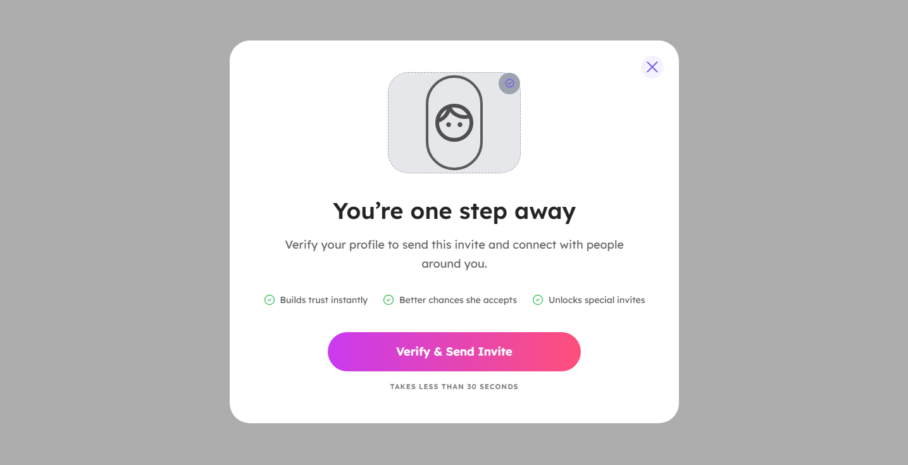
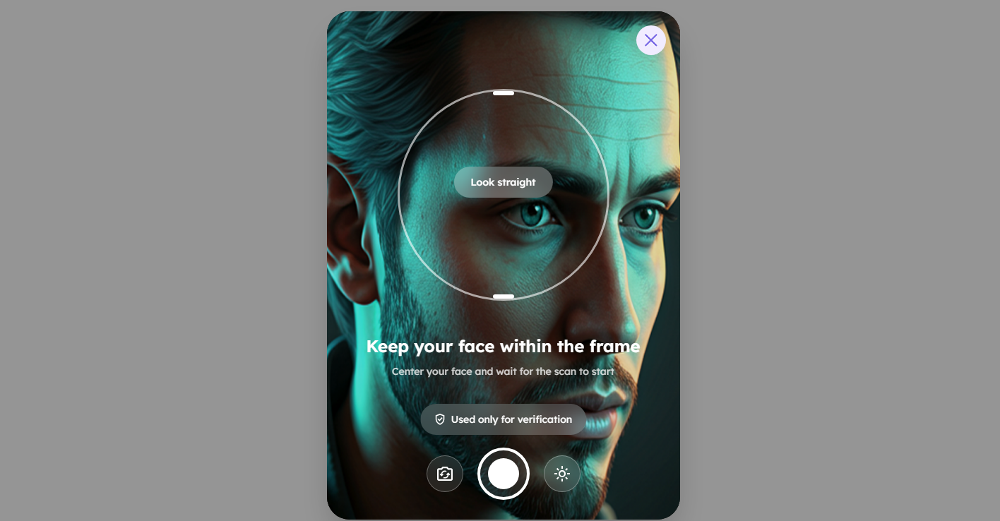
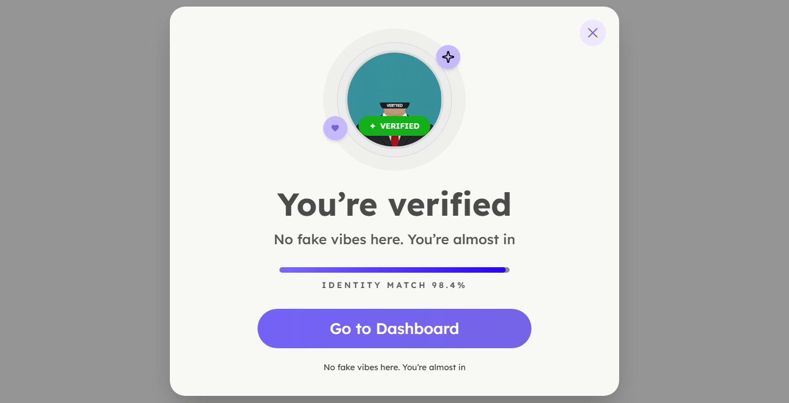
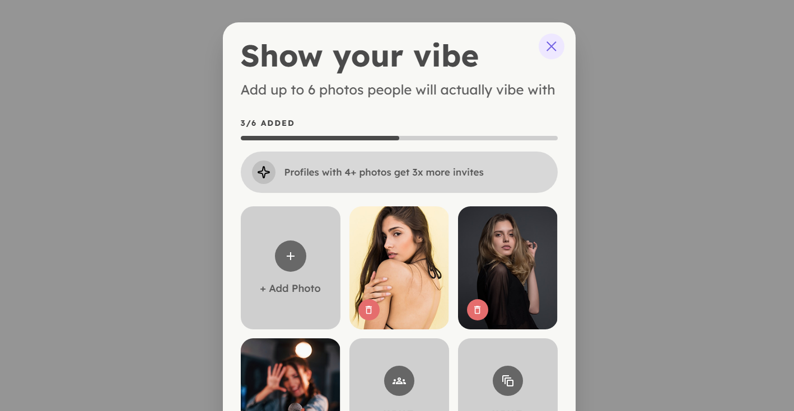

# PartyWitty React Assessment

A pixel-perfect frontend implementation of the **PartyWitty React Assessment**, built using **React.js**, **Vite**, and **Tailwind CSS** based on the provided Figma design.

This project focuses on accurate UI implementation, reusable components, navigation flow, and clean frontend architecture.

## 🔗 Live Demo

🚀 Live Website: [View Project](https://partywitty-peach.vercel.app/)

📂 GitHub Repository: [View Code](https://github.com/Dhanyaja/partywitty)

---

---

## 🚀 Project Overview

The application recreates the PartyWitty user journey where a user:

- Explores profiles on the feed
- Makes a first move by sending an invite
- Selects an event/package
- Chooses drinks
- Reviews order summary
- Completes profile verification
- Uploads vibe photos

The project follows the exact flow provided in the design assessment.

---

## 🛠️ Tech Stack

### Frontend

- **React.js**
- **Vite**
- **Tailwind CSS**
- **React Router DOM**

### UI / Styling

- Responsive layout techniques (desktop-first)
- Reusable components
- Custom gradients
- Figma design implementation
- SVG & image asset management

---

## ✨ Features Implemented

### ✅ Pixel-Perfect UI

- Implemented UI based on provided Figma design
- Accurate spacing, typography, colors, and layout

### ✅ Multi-Page Navigation Flow

Implemented complete user journey using **React Router**.

### ✅ Reusable Components

- Sidebar
- Feed Cards
- Buttons
- Verification Modals
- Drink Cards
- Info Panels
- Reusable Layout Sections

### ✅ Modern Styling

- Tailwind utility-first styling
- Clean gradients and shadows
- Smooth hover effects

### ✅ Modal-Based Verification Flow

Custom verification journey with popup interfaces.

---

## 🔄 User Flow / Navigation

### 1. Feed Page (`/feed`)

User lands on the main feed page.

**Action:**  
Click **"Go Tonight"**

⬇

### 2. First Move Popup

A modal opens allowing the user to make their move.

**Action:**  
Click **"Make Your Move"**

⬇

### 3. Event Listing Page (`/event-listing`)

User explores available party/event options.

**Action:**  
Click any event card/image

⬇

### 4. Buy Drinks Page (`/buy-drinks`)

User selects drinks and additional interactions.

**Action:**  
Click **"Make The Move Now"**

⬇

### 5. Order Summary (`/order-summary`)

Displays selected item summary and pricing.

**Action:**  
Click **"Make The Move Now"**

⬇

### 6. Verification Page (`/verification`)

User verification prompt appears.

**Action:**  
Click **"Verify & Send Invite"**

⬇

### 7. Face Verification (`/face-verification`)

Face scanning UI screen.

**Action:**  
Click capture/photo button

⬇

### 8. Verification Success (`/verification-success`)

Verification completion screen.

**Action:**  
Click **"Go To Dashboard"**

⬇

### 9. Show Your Vibe (`/dashboard`)

User uploads vibe/profile photos.

---
## 📸 Screenshots

### Feed Page
Main dashboard where users explore profiles.



---

### First Move Popup
Popup shown after clicking **Go Tonight**.



---

### Event Listing
Explore available event options.



---

### Buy Drinks
Select drinks and interaction options.



---

### Order Summary
Review selected plan and pricing.



---

### Verification Page
Identity verification prompt.



---

### Face Verification
Face scan interface.



---

### Verification Success
Successful verification state.



---

### Show Your Vibe
Upload vibe/profile photos.



---

## 📂 Project Structure

```bash
src/
│── assets/
│   ├── icons/
│   ├── images/
│   ├── logos/
│
│── components/
│   ├── AboutMe.jsx
│   ├── BillDetails.jsx
│   ├── BottomCTA.jsx
│   ├── DrinkCard.jsx
│   ├── DrinkGrid.jsx
│   ├── EventCard.jsx
│   ├── EventGrid.jsx
│   ├── EventInfoCard.jsx
│   ├── FeedSidebar.jsx
│   ├── FirstMovePanel.jsx
│   ├── GestureCard.jsx
│   ├── GestureGrid.jsx
│   ├── MoveNowButton.jsx
│   ├── OrderCard.jsx
│   ├── OrderHeader.jsx
│   ├── ProfileCard.jsx
│   ├── SearchBar.jsx
│   ├── SelectedProfileCard.jsx
│   ├── Sidebar.jsx
│   ├── TermsCheckbox.jsx
│   ├── TicketSection.jsx
│   └── TopHeader.jsx
│
│── data/
│   └── events.js
│
│── pages/
│   ├── BuyDrinks.jsx
│   ├── EventListing.jsx
│   ├── FaceVerification.jsx
│   ├── FeedBids.jsx
│   ├── GoTonight.jsx
│   ├── OrderSummary.jsx
│   ├── ShowVibe.jsx
│   ├── VerificationIntro.jsx
│   └── VerificationSuccess.jsx
│
│── routes/
│── styles/
│
│── App.jsx
│── main.jsx
│── index.css
```

---

## ⚙️ Installation & Setup

Clone the repository:

```bash
git clone <https://github.com/Dhanyaja/partywitty>
```

Navigate to project folder:

```bash
cd partywitty
```

Install dependencies:

```bash
npm install
```

Start development server:

```bash
npm run dev
```

The project will run on:

```bash
http://localhost:5173
```

---

## 📌 Notes

- This implementation is **desktop-only**, based on the assessment requirements and provided design.
- Navigation flow has been fully implemented.
- Focus was placed on **clean UI implementation**, **component reusability**, and **design accuracy**.

---

## 🎯 Assessment Goals Covered

✅ Design accuracy as per Figma  
✅ Reusable React components  
✅ Navigation flow implementation  
✅ Clean project structure  
✅ Maintainable code organization  
✅ UI consistency

---

## 👨‍💻 Author

**Dhanyaja Chakram**

Frontend Developer | React.js Enthusiast
